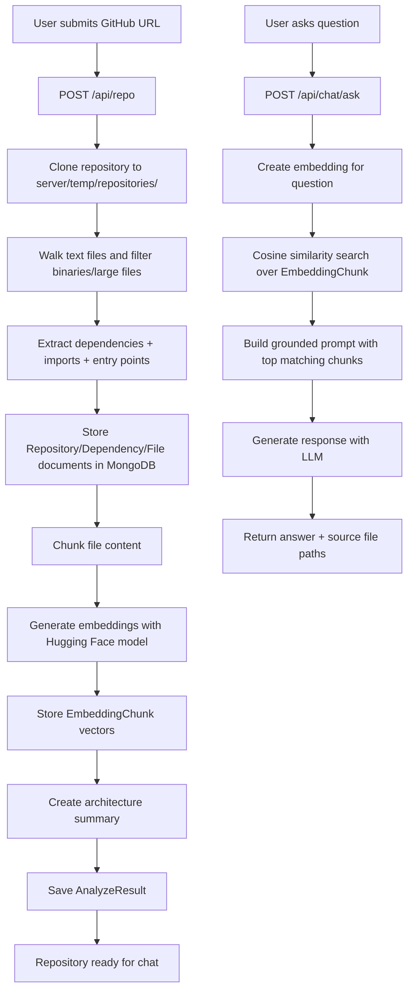

# Repo Insight AI

Repo Insight AI is a full-stack repository intelligence platform that ingests a GitHub repository, builds a semantic understanding of its codebase, and lets developers ask grounded questions about architecture and implementation.

## Problem We Solve

Modern repositories are large, fast-moving, and hard to onboard into. Typical pain points:

- New developers need hours or days to understand architecture and entry points.
- Teams struggle to trace dependency usage and code relationships quickly.
- AI answers about code are often generic and not grounded in the actual repository.

Repo Insight AI addresses this by cloning the target repository, parsing real files, generating embeddings, and answering questions using retrieval over actual code chunks.

## Solution Approach

The backend follows a retrieval-augmented workflow (RAG) specialized for source code:

1. Accept a GitHub repository URL.
2. Clone it into an isolated local workspace.
3. Parse dependencies, imports, and likely entry points.
4. Persist repository metadata to MongoDB.
5. Chunk file content and generate vector embeddings.
6. Run semantic similarity search for user questions.
7. Generate final answers only from retrieved context.

## End-to-End Workflow Diagram



## Architecture Overview

```text
client (React + Vite)
  -> repository submission UI
  -> chat-ready flow (chat request wiring pending in UI)

server (Express + MongoDB)
  -> ingestion pipeline (clone + parse + persist)
  -> vectorization pipeline (chunk + embed + store)
  -> retrieval agent (similarity search + grounded generation)

external models/services
  -> Embeddings: Hugging Face Inference API
  -> Chat generation: Groq OpenAI-compatible endpoint via OpenAI SDK
```

## Tech Stack

### Frontend

- React 19 + Vite
- React Router
- Redux Toolkit
- Axios
- Tailwind CSS + MUI + React Toastify

### Backend

- Node.js + Express 5
- MongoDB + Mongoose
- simple-git for cloning repositories
- istextorbinary for file filtering
- compute-cosine-similarity for vector retrieval

### AI/LLM

- Hugging Face model for embeddings: `sentence-transformers/all-MiniLM-L6-v2`
- Groq-hosted LLM through OpenAI SDK-compatible API (`llama-3.3-70b-versatile`)

## Core Features

- Repository ingestion from GitHub URL.
- Dependency extraction across multiple ecosystems (Node.js, Python, Go, Rust, Java).
- Import graph extraction by language.
- Entry-point detection (`app.listen`, `createRoot`, `main` signatures, etc.).
- Embedding generation and vector storage for code chunks.
- Semantic search over repository chunks.
- Grounded AI Q&A with file-path sources.
- Automatic architecture summary generation stored in analysis results.

## Current Product Status

Implemented and active:

- `POST /api/repo` pipeline is functional end-to-end.
- `POST /api/chat/ask` grounded Q&A endpoint is functional.
- Frontend repository submission flow is integrated.

In codebase but not yet mounted/connected in the main app:

- Analyze/Evaluation/Observability route/controller surface.
- Frontend chat request after repository submission (currently shows "next step" toast).

## API Surface (Currently Mounted)

Base URL: `http://localhost:3000`

### Repository APIs

- `GET /api/repo` - List repositories
- `GET /api/repo/:id` - Get repository by ID
- `POST /api/repo` - Submit repository URL and trigger ingestion
- `PUT /api/repo/:id` - Update repository metadata
- `DELETE /api/repo/:id` - Delete repository

Example request:

```json
{
  "url": "https://github.com/vercel/next.js",
  "name": "nextjs"
}
```

### Chat API

- `POST /api/chat/ask` - Ask grounded questions about analyzed repository

Example request:

```json
{
  "repositoryId": "<mongo_object_id>",
  "question": "Where is the main Express entry point and how does routing flow?"
}
```

Example response shape:

```json
{
  "success": true,
  "data": {
    "answer": "...",
    "sources": [
      "<absolute_file_path_1>",
      "<absolute_file_path_2>"
    ]
  }
}
```

## Data Model Snapshot

Key Mongo collections:

- `Repository`: metadata, ownership, local clone path, status, entry points.
- `Dependency`: ecosystem + package inventory (prod/dev).
- `File`: parsed file metadata (path, extension, imports, summaries).
- `EmbeddingChunk`: chunk text + vector + metadata for retrieval.
- `AnalysisResult`: architecture/onboarding summaries and model usage stats.
- `Evaluation`: benchmark-style QA scoring records.
- `Observability`: tokens, latency, status, and endpoint-level telemetry.

## Project Structure (Developer View)

```text
REPO-INSIGHT-AI/
|-- client/
|   |-- src/
|   |   |-- components/        # Shared UI blocks (Navbar, Sidebar, Hero)
|   |   |-- pages/             # Route screens (Welcome, Explore, Auth, etc.)
|   |   |-- services/          # API wrappers (repo submit, auth, job stubs)
|   |   `-- redux/             # Global state (auth slice, store)
|   `-- package.json
|-- server/
|   |-- src/
|   |   |-- app.js             # Express middleware + mounted routes
|   |   |-- server.js          # HTTP bootstrap + DB connection
|   |   |-- config/            # Environment and Mongo config
|   |   |-- controllers/       # Request handlers
|   |   |-- routes/            # API route definitions
|   |   |-- models/            # Mongoose schemas
|   |   |-- services/
|   |   |   |-- repository/    # Main ingestion orchestration
|   |   |   |-- parser/        # Dependencies/imports/entry-point analyzers
|   |   |   |-- embeddings/    # Chunking + embedding generation
|   |   |   |-- vector/        # Similarity retrieval logic
|   |   |   |-- agents/        # Grounded repository Q&A agent
|   |   |   |-- llm/           # LLM and embedding provider adapters
|   |   |   |-- github/        # Repo clone/fetch helpers
|   |   |   |-- observability/ # Logging/metrics/token tracking scaffolding
|   |   |   `-- evaluation/    # Quality/evaluation scaffolding
|   |   |-- middleware/        # Request logging and global error handling
|   |   `-- utils/             # Shared helpers + response wrappers
|   `-- temp/repositories/     # Runtime clone workspace (generated at ingestion)
|-- .github/                   # CI/CD/workflow metadata
`-- README.md
```

## Local Setup

### Prerequisites

- Node.js 18+
- MongoDB running locally or remote URI
- API keys for embedding + generation providers

### 1) Clone and install

```bash
git clone <your-repo-url>
cd REPO-INSIGHT-AI

cd server
npm install

cd ../client
npm install
```

### 2) Configure environment

Create `server/.env`:

```env
PORT=3000
NODE_ENV=development
MONGO_URL=mongodb://127.0.0.1:27017/repo-insight
MONGO_DB_NAME=repo-insight
FRONTEND_URL=http://localhost:5173

# LLM (used by OpenAI SDK client configured for Groq endpoint)
LLM_API_KEY=your_groq_api_key

# Embeddings
HUGGINGFACE_API_KEY=your_huggingface_api_key

# Optional/legacy key in codebase
OPENAI_API_KEY=optional
```

### 3) Run servers

Terminal 1:

```bash
cd server
npm run dev
```

Terminal 2:

```bash
cd client
npm run dev
```

Frontend: `http://localhost:5173`  
Backend: `http://localhost:3000`

## How Developers Should Navigate This Codebase

- Start with backend request flow: `app.js` -> `routes` -> `controllers` -> `services`.
- For ingestion logic, focus first on `services/repository/repository.service.js`.
- For parser support, inspect `services/parser/*` and ecosystem-specific parsers.
- For Q&A quality, inspect `services/agents/repoAgent.js`, `services/vector/similaritySearch.js`, and `services/llm/providers/*`.
- For schema evolution, update `models/*` before altering service write/read logic.
- For frontend integration, start from `pages/ExplorePage.jsx` and `services/repoService.jsx`.

## Known Gaps / Improvement Opportunities

- Mount and implement currently empty analyze/evaluation/observability controllers and routes.
- Wire frontend chat submit to `POST /api/chat/ask` after repo ingestion.
- Add pagination/filter support for repository list APIs.
- Add background job queue for large repository ingestion.
- Add stronger cleanup lifecycle for cloned repositories.
- Expand test coverage beyond `server/tests/sample.test.js`.

## Testing

Current test script exists on server:

```bash
cd server
npm test
```

The repository currently has minimal test coverage; prioritize unit tests for parser modules and integration tests for `/api/repo` and `/api/chat/ask`.

## Why This Project Matters

Repo Insight AI turns unstructured repository content into actionable, grounded developer intelligence. Instead of reading hundreds of files manually, teams can:

- Discover architecture and critical modules faster.
- Reduce onboarding time.
- Ask repository-aware questions with source-backed answers.
- Build a foundation for automated quality and observability workflows.

---

If you want, the next step can be adding a second diagram for sequence-level API flow and a contributor guide (`CONTRIBUTING.md`) aligned with this architecture.
